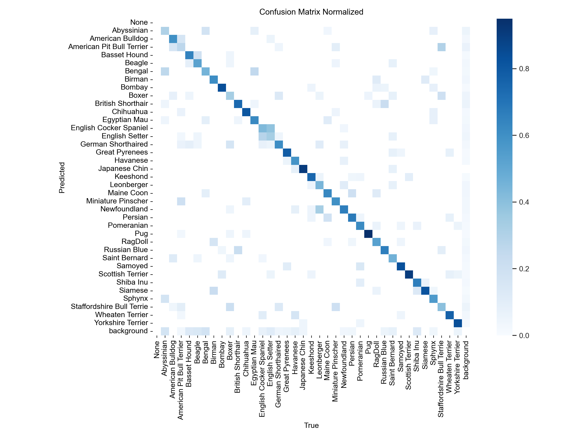
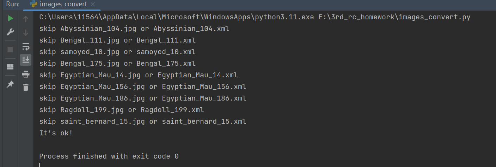
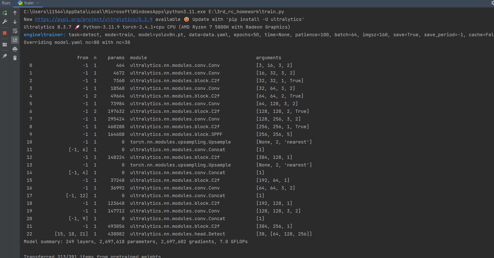
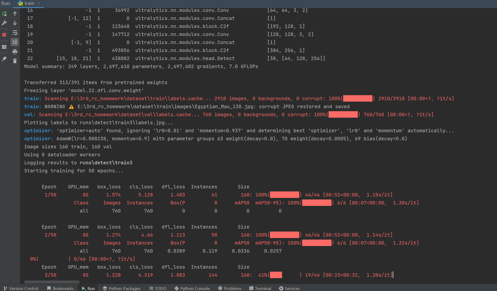
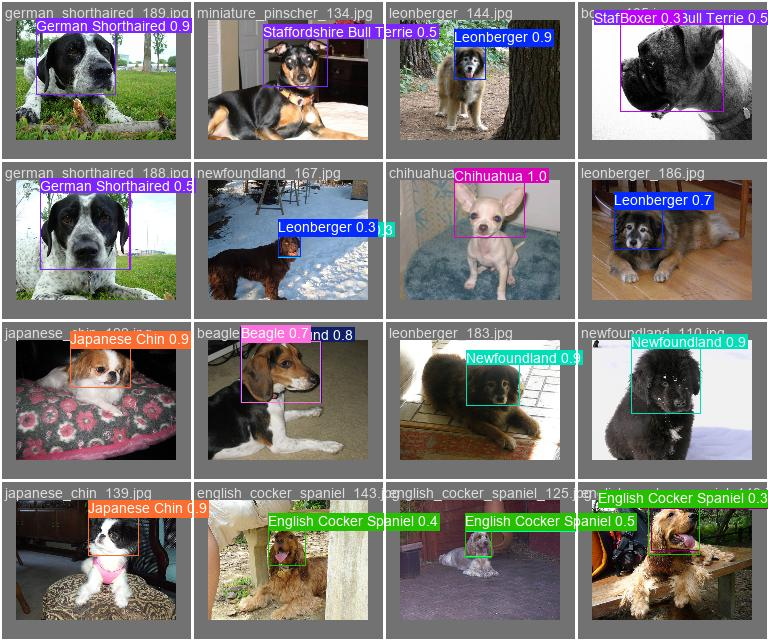
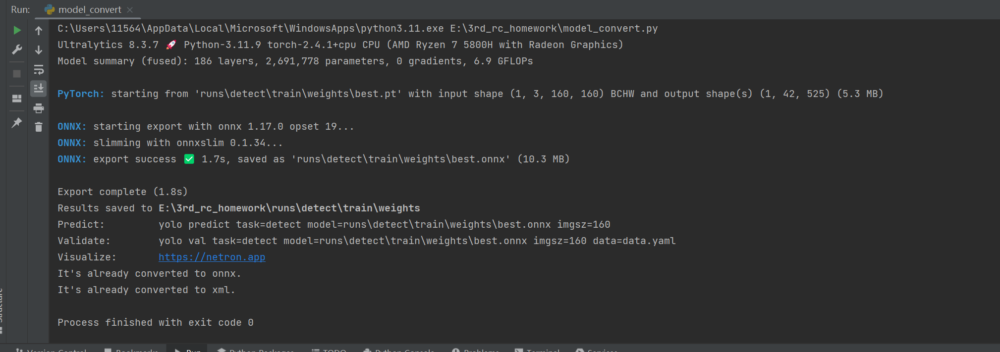
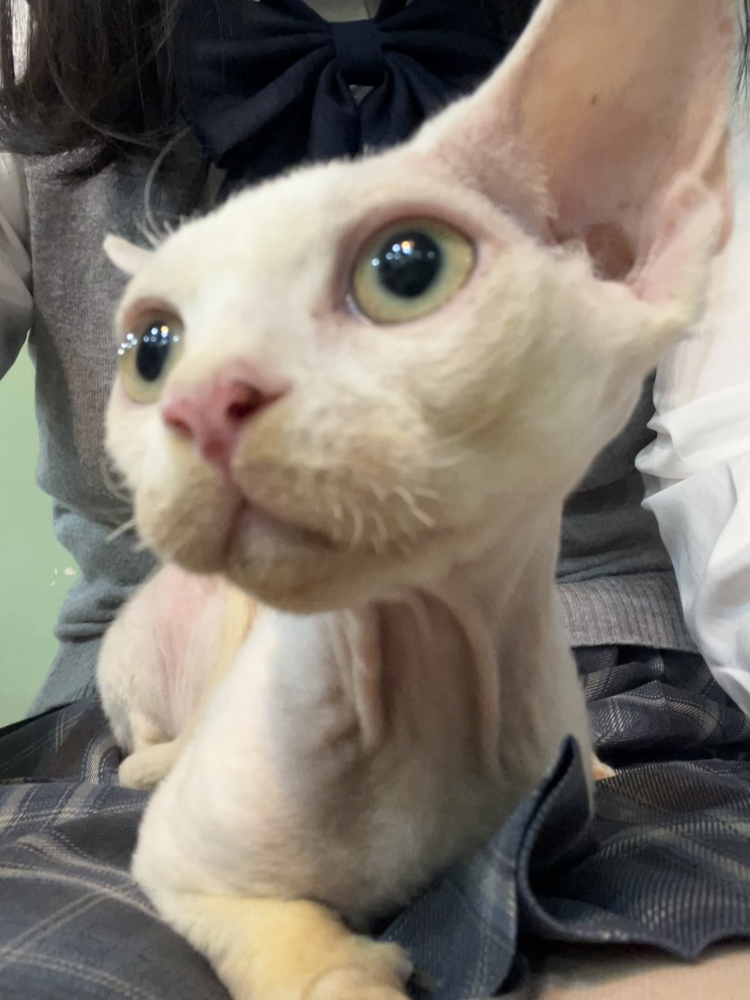
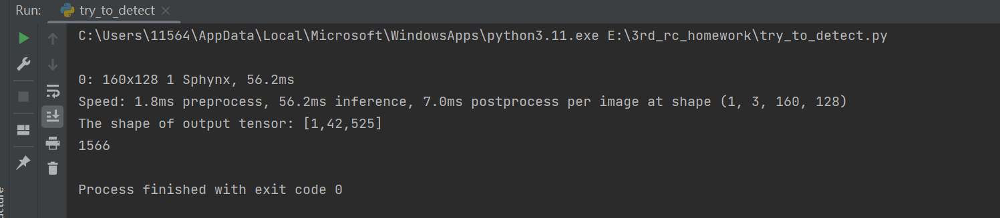

# 基于yolov8的宠物识别模型

这是一个使用Oxford-IIIT Pet Dataset训练的宠物检测与分类模型。
（社团作业，做得很烂。）

## 项目结构：

- `runs` ：用于保存每次训练好的模型
- `data.yaml` ：指定训练和验证数据集的路径，并定义数据集中包含的类别数量和名称
- `images_convert.py` ：为Oxford-IIIT Pet Dataset划分训练集和验证集，并将提供的.xml标注文件转换为.txt格式
- `train.py` ：训练模型并保存为.pt格式
- `model_convert.py` ：将.pt格式的模型文件转换为openvino可识别的.xml格式
- `try_to_detect.py` ：使用openvino对已训练的模型进行推理
- `test_images` ：保存用于测试的图像
- `screenshots` ：保存运行截图
- `readme.md`

数据集：**Oxford-IIIT Pet Dataset** 

这是牛津官方整理的一个用于宠物图像分类和分割的高质量数据集，包含37个宠物类别，包括25种狗和12种猫，每个类别大约有200张图像，适用于图像分类任务。

下载地址：https://www.robots.ox.ac.uk/~vgg/data/pets/

- 详细的数据标签见`data.yaml`

- 训练好的最优模型保存在`runs/detect/train/weights/best.pt`

- 混淆矩阵如下：

## 训练过程:

### 1.准备数据集

总所周知yolov8n要求数据集包含.jpg图像文件和.txt标注文件，然而官方在`annotations/xmls`中只提供.xml格式的标注，因此需要格式转换。同时，我们按照训练集：验证集=8：2的比例随机划分。转换后的数据集将保存在`dataset/train`和`dataset/val`中。

`python  image_convert.py`

运行结果：

### 2.训练模型

在ultralytics官方提供的`yolov8n.pt`的基础上继续训练我们的分类模型。

`python train.py`

训练过程：

详细的训练结果存储在`runs/detect/train`。下图是对验证集种某一个batch的预测结果，可见准确率还是比较高的。

### 3.模型转换

openvino需要提供.xml与.bin格式的模型，而我们目前只有best.pt，因此调用Model Optimizer API进行格式转换。转换思路是`best.pt -> best.onnx -> best.xml`。转换后的`best.xml`与`best.bin`同样存储在路径`runs/detect/train/weights`下。

`python model_convert.py`

运行结果：

### 4.模型推理

用openvino的python API进行部署和模型推理，简单输出分类结果。

yolov8每次预测包含 4 个边界框坐标、1 个置信度和 n 个类别概率。我们共有37个标签，则每次预测会包括4+1+37=42个值，需要继续解析模型输出。

`python try_to_detect.py`

（自己拍的）测试图像如下，这是一只部分姿态遮挡的无毛猫，预计输出为`Sphyhx`。

推理结果为`Sphyhx`，成功！

#### 遇到的一些问题：

1. yolov8对数据集的要求还是比较高的，常见的mnist、cifar10、cifar100基本不能用。但ImageNet、COCO这种大规模数据集用cpu很难训练。Oxford-IIIT Pet Dataset作为轻量级的数据集，还是比较适合平时自己训练的。
2. openvino的python api不好用。

